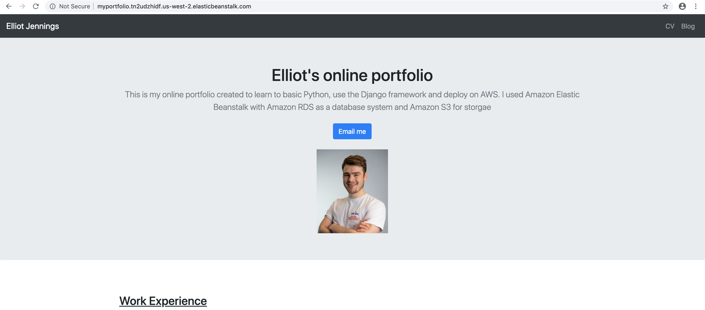
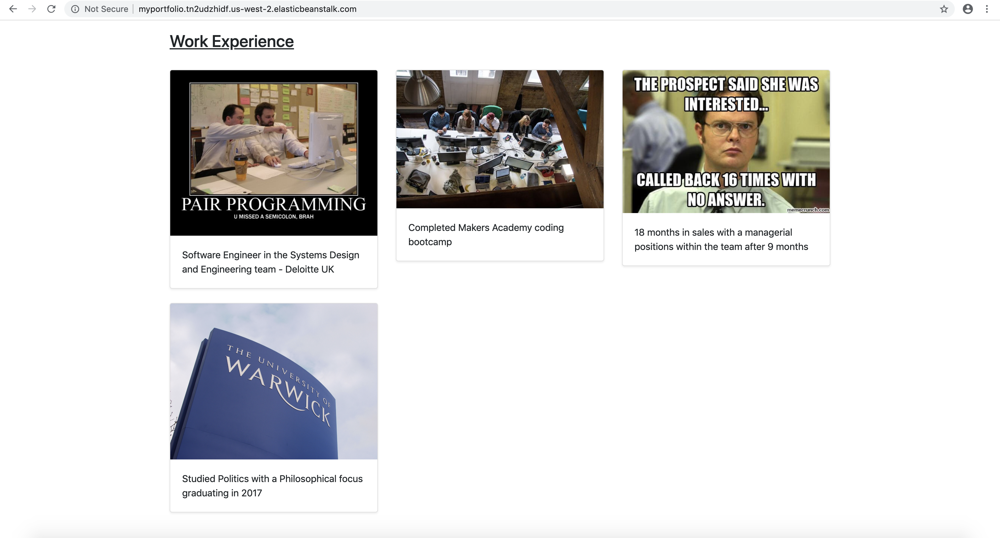
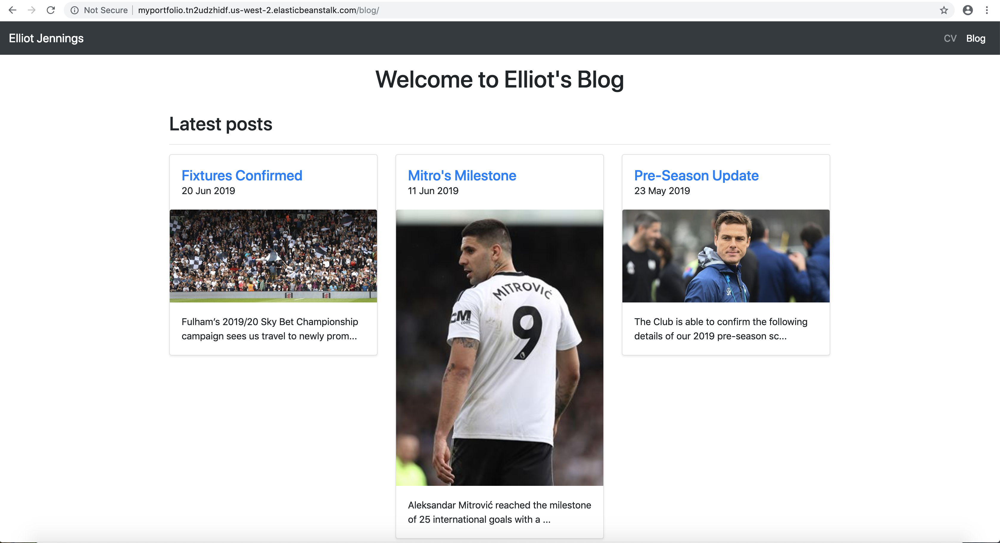
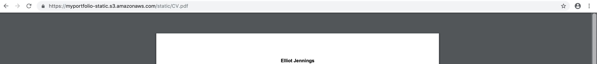

# My portfolio

This is a web app I created to learn the basics of the Django framework. Through this, I also learnt to deploy it using Amazon Elastic Beanstalk - http://myportfolio.tn2udzhidf.us-west-2.elasticbeanstalk.com/

## Screenshots due to taking down from AWS

##### Homepage

##### Work Experience

##### Blog

##### CV

